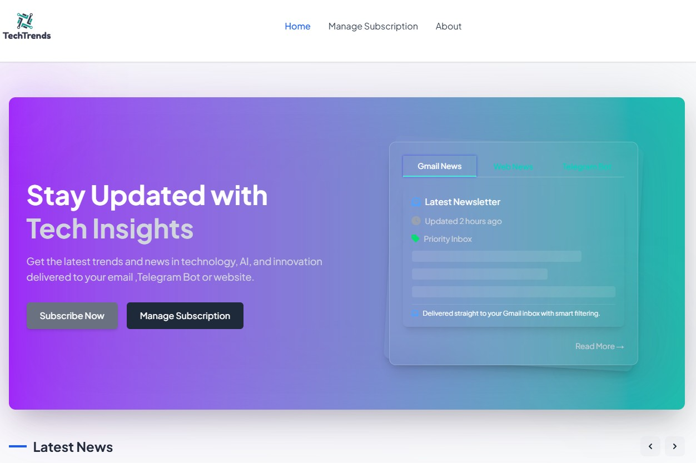
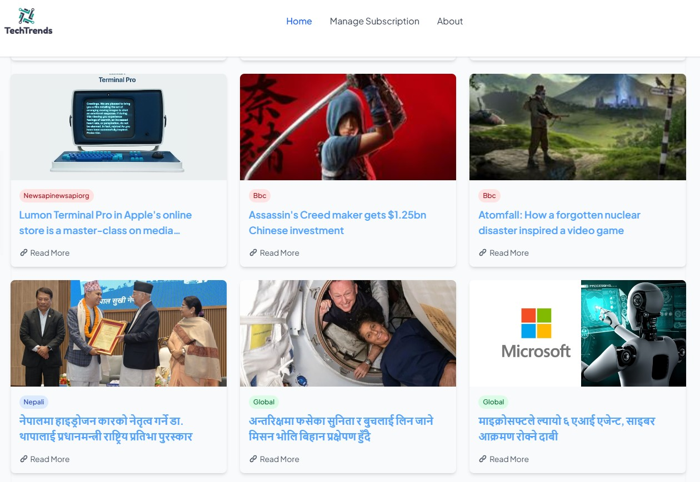

# TechTrends_FrontEnd

<p align="center">
  
</p>

<p align="center">
  <a href="https://github.com/kushal1o1/tech_trends_FrontEnd/stargazers"></a>
  <a href="https://github.com/kushal1o1/tech_trends_FrontEnd/network/members"></a>
  <a href="https://github.com/kushal1o1/tech_trends_FrontEnd/pulls"></a>
  <a href="https://github.com/kushal1o1/tech_trends_FrontEnd/issues"></a>
  <a href="https://github.com/kushal1o1/tech_trends_FrontEnd/graphs/contributors"></a>
</p>

<p align="center">
  <b>A React Frontend for TechTrends which fetches data from api of techtrends api.</b>
</p>

<p align="center">
  <a href="#features">Features</a> •
  <a href="#demo">Demo</a> •
  <a href="#installation">Installation</a> •
  <a href="#usage">Usage</a> •
  <a href="#configuration">Configuration</a> •
  <a href="#api-reference">API Reference</a> •
  <a href="#documentation">Documentation</a> •
  <a href="#roadmap">Roadmap</a> •
  <a href="#contributing">Contributing</a> •
  <a href="#license">License</a> •
  <a href="#contact">Contact</a> •
  <a href="#acknowledgments">Acknowledgments</a>
</p>


## Overview

TechTrendFrontend is a React-based web application that displays the latest tech trends, categorized into Nepali and Global sectors. The data is fetched from a Django RESTful API (TechTrendAPI). 

## Features

- **React-Based UI: A dynamic and responsive user interface built with React.**
- **Category Filtering: View tech trends categorized into many categories**
- **Simple and Clean Design: Focusing on clarity and ease of use.**
- **Subscriptions:User can subscibe email mails  for day to day news**
- **TelegramBot Guide:User can see how they can get telegram bot for news**
- **Manage Subsciptions:User can update preferences and categories**
- **Unsubscribe:user can unsubscribe anytime**
- **No Authentication:No need login or signup ,straight head to news**


## Demo

<p align="center">
  
</p>

## Screenshot




## Installation
```bash
# Clone the repository
git clone https://github.com/kushal1o1/tech_trends_FrontEnd.git

# Navigate to the project directory
cd tech_trends_FrontEnd

# Install dependencies
npm install

```

### Prerequisites
- **Node Js for react**
- **Backend api**
- **fontawesome for icons**

## Usage

```javascript
npm i 
npm start
```

## Configuration

### Configuration File

Create a `config.json` file in the root directory with the following structure:

```json
nth
```

### Environment Variables

| Variable | Description | Default |
|----------|-------------|---------|
| `REACT_APP_FONTAWESOME_URL` | fontawesomecdn | `addyours` |
| `REACT_APP_API_BASE_URL` | Run the backend of this project (techtrends) | `http://127.0.0.1:8000` |

## Directory Structure

```
project-name/
├── .github/           # GitHub specific files (workflows, templates)
├── docs/              # Documentation files
├── src/               # Source code
│   ├── components/    # UI components (for frontend projects)
│   ├── utils/         # Utility functions
│   └── index.js       # Entry point
├── tests/             # Test files
├── .gitignore         # Git ignore file
├── LICENSE            # License file
├── package.json       # Project dependencies and scripts
└── README.md          # Project documentation (this file)
```

## Technologies Used

<p align="center">


</p>

## Contributing

Contributions are what make the open source community such an amazing place to learn, inspire, and create. Any contributions you make are **greatly appreciated**.

1. Fork the Project
2. Create your Feature Branch (`git checkout -b feature/AmazingFeature`)
3. Commit your Changes (`git commit -m 'Add some AmazingFeature'`)
4. Push to the Branch (`git push origin feature/AmazingFeature`)
5. Open a Pull Request

Please make sure to update tests as appropriate and adhere to the [code of conduct](CODE_OF_CONDUCT.md).

## License

This project is licensed under the MIT License.

## Contact

[@kushal1o1](https://twitter.com/kushal1o1) - kusalbaral101@gmail.com

---

<p align="center">
  Made with ❤️ by <a href="https://github.com/kushal1o1/MDFileCreator">MdCreator</a>
</p>
